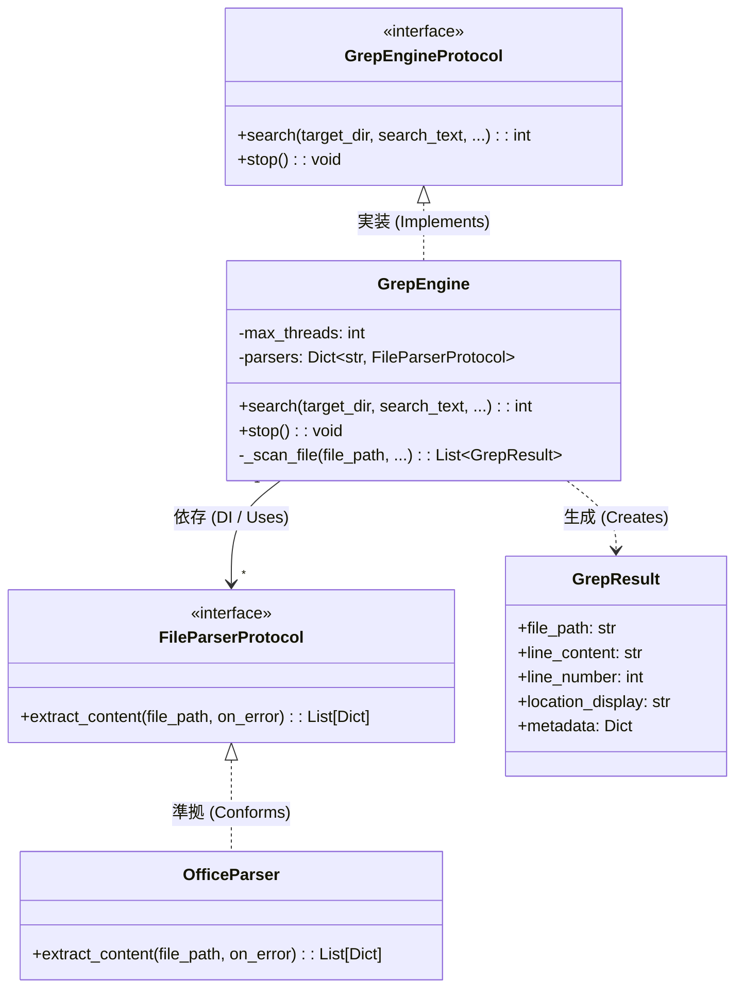
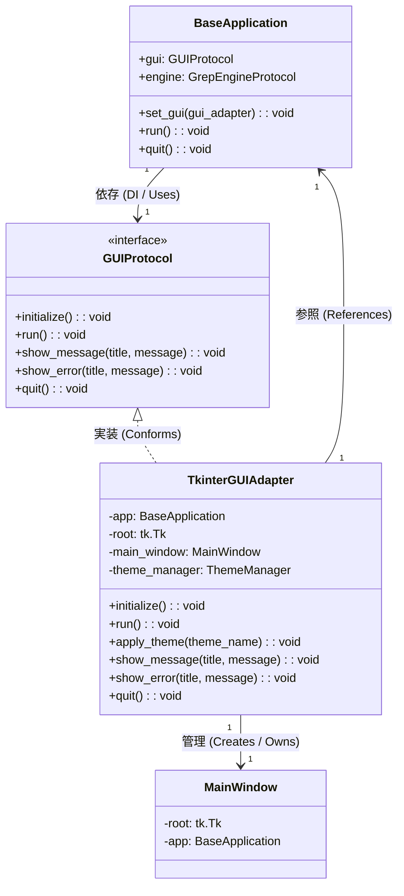

# GrepEngine & GUI アーキテクチャレビュー (疎結合設計)

本ドキュメントでは、本プロジェクトにおける `GrepEngine`（検索エンジン）および `GUI`（画面・ユーザーインターフェース）の設計について、インターフェースの分離と依存関係注入（DI）による疎結合設計の観点から解説します。

---

## 1. GrepEngine 疎結合設計

### 🏗️ エンジン部 概要
Grep 検索のコアロジックと、個々のファイル解析（特に Office ファイルなどの構造化テキスト抽出）を完全に分離しました。
エンジンは特定のパーサクラス（具象クラス）に依存せず、プロトコル（インターフェース）を介してやり取りを行います。

### クラス・関係ダイアグラム (GrepEngine)

### 主要コンポーネントの役割 (GrepEngine)
- **`GrepEngineProtocol`** ([src/grep/interface.py](file:///c:/Users/xzyoi/Desktop/python/file_grep/src/grep/interface.py)):
  GUI や CLI アプリケーション層が検索エンジンを呼び出すための共通規格。実体としての `GrepEngine` と、テスト用の `MockGrepEngine` の両方が準拠します。
- **`GrepEngine`** ([src/grep/engine.py](file:///c:/Users/xzyoi/Desktop/python/file_grep/src/grep/engine.py)):
  Grep検索の並列実行制御（スレッドプール管理）、ファイルの走査、文字コード自動判定、マッチングを行うコアエンジン。初期化時に `parsers` 引数を通じて各拡張子に対応するパーサ（`FileParserProtocol`）を受け取ります（DI）。
- **`FileParserProtocol`** ([src/grep/interface.py](file:///c:/Users/xzyoi/Desktop/python/file_grep/src/grep/interface.py)):
  ファイルからテキストコンテンツおよび位置情報を抽出するための共通規格。
- **`OfficeParser`** ([src/grep/office_parser.py](file:///c:/Users/xzyoi/Desktop/python/file_grep/src/grep/office_parser.py)):
  `FileParserProtocol` に準拠した具象実装。Word/ExcelのXML構造を解析しテキストを抽出。

---

## 2. GUI（画面）疎結合設計

### 🏗️ GUI部 概要
UIフレームワークの選定（Tkinter）にビジネスロジックやアプリケーション状態の管理クラス（`BaseApplication`）が直接依存しないように設計されています。
アプリケーションからは抽象インターフェースである `GUIProtocol` を経由して制御を行い、UI側はアダプターパターンを用いて接続します。

### クラス・関係ダイアグラム (GUI)

### 主要コンポーネントの役割 (GUI)
- **`GUIProtocol`** ([src/core/gui_interface.py](file:///c:/Users/xzyoi/Desktop/python/file_grep/src/core/gui_interface.py)):
  GUIフレームワークの種類を意識することなく、起動・ループ開始・エラー表示などのUI操作をコア側から行うための抽象規格。
- **`TkinterGUIAdapter`** ([src/tk_gui/base/tkinter_adapter.py](file:///c:/Users/xzyoi/Desktop/python/file_grep/src/tk_gui/base/tkinter_adapter.py)):
  `GUIProtocol` に適合するアダプター実装。Tkinter 特有の `tk.Tk` ルートウィンドウの生成、メインループの制御、メッセージボックスの呼び出し、テーマ（配色）変更といった処理をカプセル化します。
- **`BaseApplication`** ([src/core/base_application.py](file:///c:/Users/xzyoi/Desktop/python/file_grep/src/core/base_application.py)):
  イベント管理、多言語化（i18n）、履歴や設定マネージャーを統括するコアマネージャ。GUIの実装については、`GUIProtocol` 型の変数として保持し、具象クラスの情報を意識しません。

---

## 🌟 疎結合設計によるメリット

1. **フレームワークの独立性と将来の移行耐性**
   例えば、パフォーマンス向上やモダンなUIへの要請から、将来的に GUI ライブラリを Tkinter から `wxPython` や `PySide (Qt)` へ移行したい場合、[src/main.py](file:///c:/Users/xzyoi/Desktop/python/file_grep/src/main.py) で注入するアダプターを `WxGUIAdapter` などに入れ替えるだけで移行できます。コアビジネスロジック（`BaseApplication`）側のコードを書き換える必要はありません。

2. **テスト容易性の向上**
   GUI を介した結合テストにおいて、画面を出さずにテストを実行したい場合、`GUIProtocol` に準拠した `MockGUI` や `NullGUI` を作成して `BaseApplication` に注入することで、ヘッドレス（画面非表示）環境でも簡単にアプリケーション全体の連携テストを実施できます。

3. **統一されたエラー通知ハンドリング**
   コア側（非同期の検索処理中など）で生じた例外は、アダプターに登録されたエラーコールバック経由で一元的に通知されます。これにより、ビジネスロジック層が「どのようにポップアップを画面に表示するか」といったUIのレイアウト構造を知る必要がなくなります。
