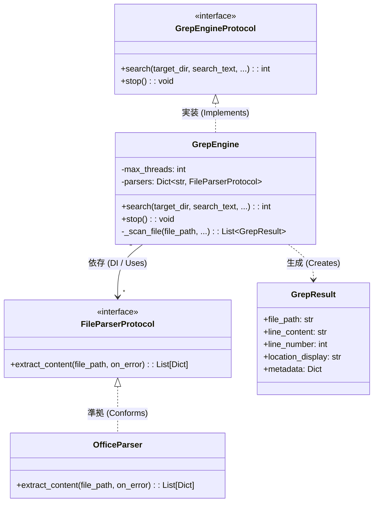

# GrepEngine アーキテクチャレビュー (疎結合設計)

本ドキュメントでは、再設計された `GrepEngine` のアーキテクチャについて、インターフェースの分離と依存関係注入（DI）による疎結合設計の観点から解説します。

---

## 🏗️ アーキテクチャ概要

Grep 検索のコアロジックと、個々のファイル解析（特に Office ファイルなどの構造化テキスト抽出）を完全に分離しました。
エンジンは特定のパーサクラス（具象クラス）に依存せず、プロトコル（インターフェース）を介してやり取りを行います。

### クラス・関係ダイアグラム

---

## 🧱 主要コンポーネントの役割

### 1. `GrepEngineProtocol` ([src/grep/interface.py](file:///c:/Users/xzyoi/Desktop/python/file_grep/src/grep/interface.py))
GUI や CLI アプリケーション層が検索エンジンを呼び出すための共通インターフェースです。
実体としての `GrepEngine` と、テスト等で使用される `MockGrepEngine` の両方がこのプロトコルに準拠します。

### 2. `GrepEngine` ([src/grep/engine.py](file:///c:/Users/xzyoi/Desktop/python/file_grep/src/grep/engine.py))
Grep検索の並列実行制御（スレッドプール管理）、ファイルの走査、文字コード自動判定、マッチングを行うコアエンジンです。
- **DIによる動的パーサ登録**: 初期化時に `parsers` 引数を通じて各拡張子に対応するパーサ（`FileParserProtocol`）を辞書形式で受け取ります。
- **動的ディスパッチ**: `_scan_file` 内でファイル拡張子をキーとして登録パーサを検索し、存在すればそのパーサに抽出処理を委譲します。

### 3. `FileParserProtocol` ([src/grep/interface.py](file:///c:/Users/xzyoi/Desktop/python/file_grep/src/grep/interface.py))
ファイルからテキストコンテンツおよび位置情報を抽出するための共通規格です。
- メソッド：`extract_content(file_path, on_error)`
- 戻り値：`List[Dict[str, Any]]`（各要素に `text`, `location`, `metadata` を含む）

### 4. `OfficeParser` ([src/grep/office_parser.py](file:///c:/Users/xzyoi/Desktop/python/file_grep/src/grep/office_parser.py))
`FileParserProtocol` に準拠した具象実装クラスです。
Word (`.docx`, `.docm`) および Excel (`.xlsx`, `.xlsm`) の XML 構造を解析し、位置情報付きでテキストを抽出します。

---

## 🌟 疎結合設計によるメリット

1. **拡張容易性 (Open/Closed Principle)**
   将来的に PDF (`.pdf`) や一太郎 などの新規ファイル形式の検索に対応する際、`GrepEngine` クラスの内部コードを書き換える必要はありません。
   `FileParserProtocol` に準拠したパーサ（例: `PdfParser`）を新規作成し、エンジン起動時に注入するだけで検索機能を拡張できます。

2. **テスト容易性 (Testability)**
   `GrepEngine` 単体の動作確認（スレッド処理やタイムアウト、一時停止機能の検証など）において、実際のファイルシステムや重いパーサに依存することなく、モックパーサを注入した軽量で信頼性の高いテストを記述できます。

3. **単一責任の原則 (Single Responsibility Principle)**
   - `GrepEngine`：スキャンの並列化と一致判定に集中
   - `OfficeParser`：Officeファイルのパース（構造解析）に集中
   それぞれの責務が完全に分離されており、メンテナンスが容易です。
